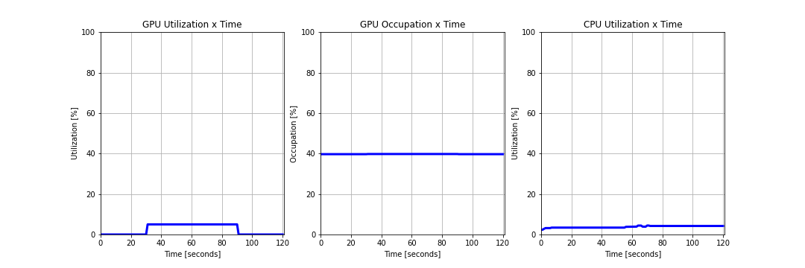
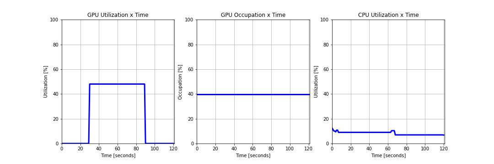
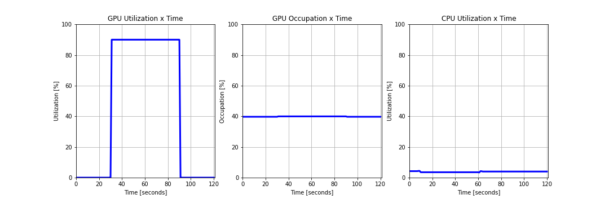
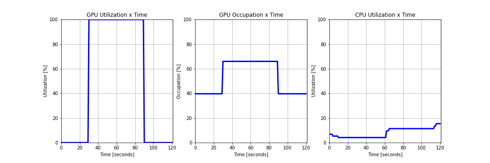
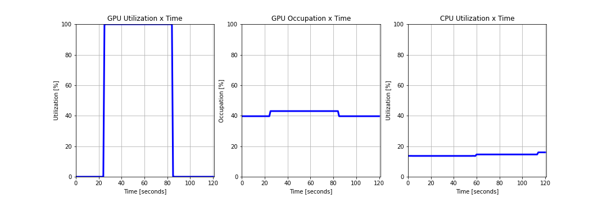
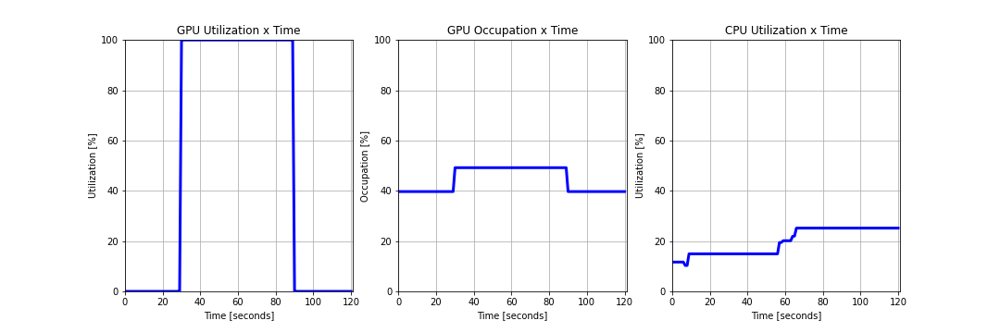

# ML Assignment
Please implement a translation inference service that runs on Kubernetes and provides a RESTful API on port 9527.

The translation model is `M2M100`, and the example can be found in `app/translation_example.py`.

You should first fork this repository, and then send us the code or the url of your forked repository via email. 

**Please do not submit any pull requests to this repository.**


## Delivery
- **app/Dockerfile**: To generate an application image
- **k8s/deployment.yaml**: To deploy image to Kubernetes
- Other necessary code

## Input/Output

When you execute this command:
```bash
curl --location --request POST 'http://127.0.0.1:9527/translation' \
--header 'Content-Type: application/json' \
--data-raw '{
    "payload": {
        "fromLang": "en",
        "records": [
            {
                "id": "123",
                "text": "Life is like a box of chocolates."
            }
        ],
        "toLang": "ja"
    }
}'
```

Should return:
```bash
{
   "result":[
      {
         "id":"123",
         "text":"人生はチョコレートの箱のようなものだ。"
      }
   ]
}
```

## Bonus points
- Clean code
- Scalable architecture
- Good inference performance
- Efficient CPU/GPU utilization

# Solution Discussion
## Code
The code was divided into 3 modules:
- model.py: Here was created a Predictor object with methods for streamlining the prediction process. 
- api.py: Here were created objects defining requests body specifications and a FastAPI object responsible for routing requests and calling the predictor defined in model.py.
- main.py: Here was defined the driver function that can be called for starting the api using the uvicorn framework.

### Predictor
Given that the prediction process is divided in a few steps, it is interesting to create a method of grouping those steps together so that we only need to make one call to perform the prediction. Since a few parameters are constant throughout every prediction request, wrapping those steps in an class allows us to keep track of these parameters, while still allowing customization. The auxiliary methods implemented on this class are the following:
- __init__:
- save: Instantiate the tokenizer and model instances based on environment variables; define which device to use based on availability and set model configurations accordingly. While running on GPU, it is necessary to set the share_memory on the model, so it doesn't error out due to GPU memory allocation. When using multiple workers, it is also necessary to set the number of threads to 1, otherwise each thread tries to create a new cuda device and it fails.
- build: This function is a helper to guarantee model has been loaded and is capable of performing predictions;
- predict: Encapsulates the prediction steps for the tokenizer and model, transitioning devices as necessary.
- get_predictions: Preprocess the inputs and generates batches for performing predictions. Since each request can have only one input or dozens or hundreds it is important to set a batch limit to our model processing thus guaranteeing memory/CPU/GPU utilizations are under control. 

Batch size and number or workers need to be adjusted based on the type of requests that are expected by the application, several requests with few inputs or few requests with several inputs. In the first case, it is better to increase the number of workers and reduce batch size, while in the latter it is better to increase batch size and reduce workers. This also depends on how much compute resources are available.

## Containerization
After building the application, we need to pack it all inside a container. We start by defining a Dockerfile based on the Pytorch-Cuda image, since we are gonna deploy the application on GPU powered machines. It is necessary to match the Cuda versions that are supported by both the deployment devices and the pytorch version. In this case, CUDA 11.3 was selected, with CUDNN 8 and Pytorch 1.11.0.
We also define a set of dependencies to run our application. In this case we require Senterpiece and Transformers for the model inference, FastAPI, Uvicorn for model serving.

For building the image, we use Docker from the root folder(Make sure docker engine is running). I will be tagging the image with my own repository, so that I can push it later and use on the Kubernetes cluster.

$ docker build ./app -t eduardojuniolagobatista/translation:m2m -f app/Dockerfile

For testing it locally, we can simply run our image and binding the ports:

$ docker run --rm -p 9527:9527 eduardojuniolagobatista/translation:m2m

This will create a container based on the image we just created and will run our application locally with the default specifications we defined in our Dockerfile. For the first run, the application will download the models and configuration files, so it might take a few minutes to start. Since it's a local run, we limit our application to 1 worker only, in order not to overload the machine.
After the application is running we can send requests to it by using:

$ curl --location --request POST 'http://127.0.0.1:9527/translation' --header 'Content-Type: applicatta-raw '{"payload": {"fromLang": "ja","records": [{"id": "123","text": "人生はチョコレートの箱のようなものだ。"}, {"id": "124","text": "人生はチョコレートの箱のようなものだ。"}, {"id": "125","text": "人生はチョコレートの箱のようなものだ。"}],"toLang": "en"}}'

Which should return:

$ {"result":[{"id":"123","text":"Life is like a box of chocolate."},{"id":"124","text":"Life is like a box of chocolate."},{"id":"125","text":"Life is like a box of chocolate."}]}


## Design Considerations
1. Uvicorn was chosen for deployment due to its easy to use worker escalability.
2. Using a preloaded model that would be shared among all workers. This creates a few problems, since Pytorch is not thread safe when allocated on GPU's, due to memory menagement. This can be solved by spawning subprocesses manually, through the pytorch multiprocessing module, however, this creates another bottlenck, which is the inferenece performance, since now we need to be careful on how to process inputs, since the model is shared by many workers and any changes to it will affect other requests.
3. The option chosen therefore was to spawn the whole process on the workers, meaning the model gets instantiated in each worker. This is not optimal due to the exponentiation of compute required to store all these copies at the same time, but it has the benefit of keeping processes isolated, meaning each request gets processed by an independent model, avoiding unpredicted interferences.
4. Horizontal auto-scaling was chosen due to its simplicity of deployment and development. Horizontal means that whenever the load increases to beyond limits, another container is spawned to help take care of the load and this container gets deleted when the load becomes lighter. We could decide for a vertical scaling, simply adding more resources to our application, but this would require restarting our application and increasing the number of workers.

## Deployment to Kubernetest Cluster
With the image built, we first need to push it to the repository:

$ docker push eduardojuniolagobatista/translation:m2m

The second step is to write the deployment manifest necessary for running the application. The manifest can be found on ./k8s/deployment.yaml. A few key points should be noted on the manifest:
1. We define the manifest with 1 shared volume mounted to /model. This volume is used to store model weights and configurations to be used by all workers of the application. We could specify a Persistent Volume through a Persistent Volume Clam, but since these specifications can be very specific to cluster settings, using a share volume is a good strategy to be cluster agnostic.
2. We define 1 init container. As explained before, the first time running the application, model weights need to be downloaded from the repository to be made available. If we leave the model to be downloaded through the FastAPI application, using multiple workers will cause conflict and will keep failing the workers until the model download is completed. Thus it's better to set up a init container downloading the model and serving it locally (inside the shared volume) and loading these weights locally inside the workers. We achieve this by setting the SAVE_WEIGHTS and MODEL_WEIGHTS environment variables inside the container definitions. 

Setting SAVE_WEIGHTS in the init container, downloads the default model weights from the repository (MODEL_WEIGHTS is set to facebook/m2m100_418M); while in the init container, we point MODEL_WEIGHTS to the shared volume we mounted.

Other considerations to make based on your cluster infrastructure:
1. Resources limits and requests: We set CPU, memory and NVIDIA GPU specifications
2. We set our application Ports, so it can be accessed externally.
3. We set other environment variables, namely BATCH_SIZE and APP_WORKERS, that define specifications to our application.

A service is also specified in the manifest and it will serve as the means to access our application from outside the cluster. The service defines the port it should connect to from the deployment. It also needs a specification of type; in this case we are gonna use ClusterIP instead of NodePort. The type specification depends o the way of accessing the service endpoint. In a real deployment situation, we should use NodePort, which will expose the specific port to be exposed through a LoadBalancer to the internet. This LoadBalancer can be created on Cloud providers and need to link to the cluster external IP and the random port assigned to our application by Kubernetes.
Since we want to access our application from localhost:9527, we can use a ClusterIP, which exposes our service endpoint only internal to the cluster, but with port-forwarding, we are able to bind that service port to one of our local machines.

Finally, an autoescaler is also specified. This autoscaler is responsible for watching our specified deployment metrics and judging if the current setup is enough for handling the application load. For this case, we monitor GPU utilization, CPU utilization and memory utilization, all with a threshold of 80\%. We also set the minimum number of replicas to 1 while the maximum to 2. This configuration means our application will start running on only 1 pod and, if there is enough load to consume more than 80\% ofcpu, memory or gpu, another pod will be spawned to handle the extra load.

With everything set and a connection to a kubernetes cluster, you can deploy your resources as:

$ kubectl apply -f k8s/deployment.yaml

This will create the 3 resources on the default namespace.
Finally, you can bind your local port to the service exposing the application with:

$ kubectl port-forward service/fastapi-m2m-translation 9527

With all that in place we can start sending requests to our api and checking the results:

$ curl --location --request POST 'http://127.0.0.1:9527/translation' --header 'Content-Type: application/json'  --data-raw '{"payload": {"fromLang": "ja","records": [{"id": "123","text": "人生はチョコレートの箱のようなものだ。"}, {"id": "124","text": "人生はチョコレートの箱のようなものだ。"}, {"id": "125","text": "人生はチョコレートの箱のようなものだ。"}],"toLang": "en"}}'
>> {"result":[{"id":"123","text":"Life is like a box of chocolate."},{"id":"124","text":"Life is like a box of chocolate."},{"id":"125","text":"Life is like a box of chocolate."}]}

## Tests
Let's try testing out our application. With the port-forwarding still open, we can run the script stress_test.py to send requests to the api endpoint for querying predictions. The script accepts 3 parameters: pay-size, which increases the number of records sent on the same request; num-req, which sets the number of requests to send to our api; sleep, which sets the interval at which we are gonna query our endpoint.

Let's try our first test, a very light workload. This will send 100 requests with only 1 record each, at 0.5s intervals.

$ python app/stress_test.py --pay-size 1 --num-req 100 --sleep 0.5
[...]
>> 100.00\% of requests were successfull with average of 0.41s, minimum of 0.28s and maximum of 1.32s response time



We can see that for unit requests, Memory occupation on the GPU is barely noticeable while the utilization rises to about 30\%. That is expected since, compared to the model the input tensors occupy tittle memory but the graph computation is very expensive. However, each request still is processed faster than the interval in which requests are submitted. 

Now let's check the influence of batch size in our model performance.

$ python stress_test.py --pay-size 16 --num-req 100 --sleep 0.5
[...]
>> 100.00\% of requests were successfull with average of 0.62s, minimum of 0.53s and maximum of 0.88s response time



We can see the benefits of batch processing: with 16x the input size, it only takes 1.5x longer for the inference to run. We can also see that regarding GPU occupation and utilization don't differ much from the unit case.

Now let's push it higher. Let's send unit requests but almost at the same time:

$ python stress_test.py --pay-size 1 --num-req 100 --sleep 0.1
[...]
>> 100.00\% of requests were successfull with average of 0.42s, minimum of 0.24s and maximum of 1.16s response time



For unit requests, little change can be seen on the behavior of our model, with the exception of the utilization. Since our model is being requested more often, it is normal to expect that all workers are working at maximum capacity for handling the load.

Again, let's increase the batch size to see the effect:

$ python stress_test.py --pay-size 16 --num-req 100 --sleep 0.1
[...]
>> 43.00\% of requests were successfull with average of 10.37s, minimum of 1.84s and maximum of 12.91s response time



Now we can see that more than half of our requests did not get any predictions back, due to unnavailable workers to process the requests. While  checking the utilization and occupation we can see that utilization is at maximum while occupation is 25% higher than normal. This indicates that we might be able to start a few more workers to handle a few more requests at a time, at the cost of taking longer for each prediction. However, by the time each worker finishes one prediction, a few requests have been already denied.

Lastly, let's consider a very extreme case, where all requests are sent practically at the same time:

$ python stress_test.py --pay-size 1 --num-req 100 --sleep 0.01
[...]
>> 36.00\% of requests were successfull with average of 3.27s, minimum of 1.92s and maximum of 3.61s response time



As possibly expected, even for unit requests, our model is only capable of handling one third of the load. GPU utilization is at maximum but with very low memory occupation. Here, the only solution is adding more workers to the process or increasing the number of concurrent requests our model can handle.

$ python stress_test.py --pay-size 16 --num-req 100 --sleep 0.01
[...]
>> 36.00\% of requests were successfull with average of 13.69s, minimum of 13.33s and maximum of 14.01s response time



Lastly, with a bigger batch size we observe the same effect as before, GPU utilization is at the maximum, while memory allocation still offers possibilities for improvement. 

In no test CPU utilization appeared significant compared to the GPU effect, which was expected since the CPU operations computed are fairly simply while the model prediction, which is the most computationally expensive operation is performed entirely on GPU.


## Conclusion
Based on the tests performed there are a few strategies that can be used to optimize the application performance but they all require understanding of the expected load for the application:
- Case 1: If expected requests are in the form of several requests with few records, increasing the number of workers is a good approach, since there is memory available for model allocation together with vector operations, besides increasing the number of replicas in the deployment;
- Case 2: If expected requests are in the form of few requests with several records, increasing the number of workers will cause Memory allocation issues on the GPU breaking the application. In this case, the best solution is to increase the number of replicas in the deployment to use more GPU's and thus handle more requests.

An alternative would be to implement multiprocessing only in the inference level of the application, sharing model weights throughout all workers. However, this would require a designed algorithm to guarantee the independence of each worker process in regards to the others, since now they use the same model. It also doesn't help with the response time, however, only with the number of requests that can be handled at a single time, so the complications don't seem to pay off.

Increasing concurrency might be a good solution in case response time is not very restrictive, otherwise, concurrency should be kept low so that requests can either retrieve the predictions as fast as possible or fail as soon as possible.

Lastly, the safest solution possible to the problem is scaling the available resources to the application, either using more pods or using multiple GPU's.

In regards to autoscaling, when our workload achieved 80% on GPU utilization, a new pod was spawned to help take care of the workload. Pay attention that for the autoscaling to work properly, Prometheus and Kube-metrics are required so that metrics can be retrieved and compared.

### Alternatives
Another way that can be used for deploying the model is to use Redis or other message broker as an intermediate step for storing the requests To be passed down to the model. This approach can improve the model runtime, by forcing the model to be processing the inference most of the time. This also has the advantage of decoupling the processes (requests handling and modeling) allowing for a finer tuning of parameters based on the workload received at the time, being spawning more models or more API's. This approach would be suggested in case of multiprocessing the model, since we could use the same model in several predictions at the same time. 
The down side is the network dependincy, since now we have to transfer data from the API to the database and from the database to the model (and the way back). So a deeper investigation would be necessary considering the conditions to be met. 

## Setup used
Docker version - Server 4.7.1
Kubernetes cluster 1.23.10
NVIDIA V100 GPU
Driver version 510.73.05 
Cuda version 11.6